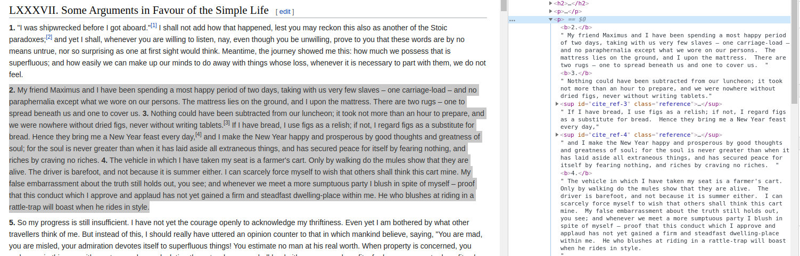

Seneca Tweets: A Tweet Bot Powered by GPT-2 and Ancient Daily Wisdom
================

## 0\) Introduction

I am very interested in analyzing time-series data, and was wanting to
learn more about the transformer architecture that underlies state of
the art natural language processing models in machine learning. In late
2019, OpenAI revealed their game changing GPT-2 model which is capable
of generating very realistic text. After some initial hesitation, they
also released smaller versions of the model to the public (and later,
the full version), leading to varied and often creative uses for model’s
ability to construct somewhat convincing text after some additional
training. So, I thought, what better way to learn about the technology
and its capabilites than by digging in with my hands and using GPT-2 to
power my own Twitter bot?

I decided to train the model on the work of one of my favorite sources
of philosophical wisdom: Seneca’s letters to his friend Lucilius. Seneca
is a renowned Stoic philospher from 1st century Rome, who had the
unenviable of task of advising the young Emperor Nero and assisting him
in day to day matters running the state. Later in life, Seneca crafted a
collection of letters framed as correspondence to a close friend, but
also convenient a format for detailing the applications of Stoic
philosophy to the kinds of matters one is likely to encounter on a daily
basis. In these letters, Seneca muses about topics such as drunkeness,
solitude, aging, illness, friendship, suicide, and death. While many
such topics might seem morbid by today’sensibilities, such a fixation on
death and suffering are common fodder for Stoic philosophers more
generally (how better to test Stoic resolve than in the face of death?)
and may reflect the realities of ancient life. Indeed, Seneca’s own life
came to an end by suicide, ordered as a punishment for his alleged
involvement in an assassination plot against Emperor Nero.

Seneca’s *Letters* also seemed a good choice because they contain
numerous passages about mundane topics as well as diatribes into matters
seemingly unrelated to the main topic of the letter. Consider, for
example, these reflections on how bee’s make honey:

> It is not certain whether the juice which they obtain from the flowers
> forms at once into honey, or whether they change that which they have
> gathered into this delicious object by blending something therewith
> and by a certain property of their breath. For some authorities
> believe that bees do not possess the art of making honey, but only of
> gathering it; and they say that in India honey has been found on the
> leaves of certain reeds, produced by a dew peculiar to that climate,
> or by the juice of the reed itself, which has an unusual sweetness,
> and richness. And in our own grasses too, they say, the same quality
> exists, although less clear and less evident; and a creature born to
> fulfil such a function could hunt it out and collect it. Certain
> others maintain that the materials which the bees have culled from the
> most delicate of blooming and flowering plants is transformed into
> this peculiar substance by a process of preserving and careful storing
> away, aided by what might be called fermentation, – whereby separate
> elements are united into one substance.
> 
> \-*Letters LXXXIV, On Gathering Ideas*

Fascinating stuff. Of course, Seneca always ties these observations back
into the main topic of his letter, but one can only imagine his thoughts
on the small matters we face in the modern world. Also, I find some
passages from Seneca to be indecipherable, and thought it would be
amusing to produce fake text that is similarly difficult for the reader
to glean wisdom from.

## 1\) Gathering the text for training the GPT-2 model

Code for scraping the text of Seneca’s letters is contained in the
`scrape_letters.py` file. The text comes from
[Wikisource.org](https://en.wikisource.org/wiki/), and is, of course, in
the public domain.



Most of the work gathering the text of each letter from websites is
handled by the `requests` and `bs4` (BeautifulSoup) libraries, which are
used for managing HTTP requests and parsing the responses, respectively.
If you navigate to the [Wikisource page featuring a list of Seneca’s
letters](https://en.wikisource.org/wiki/Moral_letters_to_Lucilius) and
browse a handful of examples, you will notice they follow a similar
layout and presentation. Inspecting the underlying HTML code indeed
reveals that the content of the letters is contained within the
paragraph tags (`<p>`). The scraper works by gathering the content of
these paragraph tags and then formatting the text for training purposes.
Below is some of the code for scraping the text of the letters from the
site:

``` python
# Create a web scraper to obtain English translations of Seneca's letters to his friend Lucilius
class Scraper:

    def __init__(self, index:int):
        self.letter_index = index
        self.url = f"https://en.wikisource.org/wiki/Moral_letters_to_Lucilius/Letter_{self.letter_index}"
        self.USER_AGENT_HEADERS = {"user-agent":"Mozilla/5.0 (X11; Ubuntu; Linux i686; rv:24.0) Gecko/20100101 Firefox/24.0"}
        self.letter = ""
        
    def scrape_letter(self):
        # GET request
        self.response = requests.get(self.url, headers=self.USER_AGENT_HEADERS)
        # if response status code is 200
        if self.response:
          try:
              #Parse HTML response
              soup = BeautifulSoup(self.response.text, 'html.parser')
              raw_text = soup.findAll("p")
              just_text = [t.text for t in raw_text]
              for paragraph in just_text:
                  self.letter += paragraph
          except AttributeError:
              print("Something went wrong (Attribute Error)")
        else:
            print(f"Webpage response status code did not return 200 (STATUS: {response.status_code})")
```

Once the text is scraped, formatted, and saved to disk as a `.txt` file,
you are ready to train your model on the corpus.

## 2\) Training the model

Most of the heavy lifting in training the model was done using [Max
Woolf’s](https://minimaxir.com/) `gpt_2_simple` library along with the
Google Colaboratory notebook provided on his [GitHub
repo](https://github.com/minimaxir/gpt-2-simple). The notebook and
library make it easy to train a version of GPT-2 on a Google hosted
runtime with powerful GPUs, a task I fear that my notebook might not be
capable of handling. You can also save your trained model to your Google
Drive for use later on when wanting to generate some original text. I
also found that, despite the warning in Max’s notes, the 774 million
parameter version of the model **could in fact be trained in the
Colaboratory environment** (it is about 3GB on local storage). Be aware
that `gpt_2_simple` requires Tensorflow 1.x. You may find it is better
to run your downloaded model within a virtural environment if you often
use Tensorflow 2.x for other tasks.

Once you have run through the steps in the Colaboratory notebook and
downloaded your model that was trained on the text scraped in (1), you
are ready to start generating text for Twitter status updates. Note that
the scripts from this repo assumes your downloaded model is in a
directory named `checkpoint/`, within your project folder.

## 3\) Creating the Twitter bot

The `tweepy` module will be the main workhorse for this tasks, but the
`schedule` module will prove important for operating the Twitter bot in
the background later on. Install them using `pip` if need be.

    pip install tweepy schedule

First, you will need to create a new Twitter account and request API
permissions from [Twitter’s developer
portal](https://developer.twitter.com/en). Once you have done so, you
should be able to find the four API keys tied to either your account or
specific app that are needed for authentication from the Python
environment. In order to authenticate, you will need to include a file
`tokens.json` with the necessary API keys. In the GitHub repo, I have
also included a file `tokens_example.json` as a template that can be
saved and renamed. The code for the Twitter bot is available in the file
`twitter_bot.py`.

The function for generating text from the GPT-2 model and parsing the
result for a Twitter status update is given below. A longer text
sequence (2x the desired Tweet length) is generated using a random
phrase from Seneca’s works. The text is then cut off before the
specified word count is exceeded, but only complete sentences will be
retained. The text will not cut off in the middle of a sentence. The
text from the retained sentences are then combined and split again, this
time into a list of individual words. The words are then recombined into
phrases, one by one, without exceeding the maximum Tweet length (280
characters). These phrases form the text for each status update, and
will often end in the middle of a sentence (never in the middle of a
word). With the text ready to be posted, the only step left is the
ensure the tweets appear in reply to the status update that preceeded it
(except for the first update). This will form a coherent thread of
tweets.

``` python
#Load pre-trained model from storage
sess = gpt2.start_tf_sess()
gpt2.load_gpt2(sess)
print(sess)
`<tensorflow.python.client.session.Session object at 0x7ff01468be10>`

#Create function that generates new text (with parameters) and updates Twitter status
def new_status(word_count: int=500, temperature: float=0.7):
  #output file name
  prefix = phrase_starters[rand.randint(0, len(phrase_starters))]
  output_file = 'text/gpt2_gentext_{:%Y%m%d_%H%M%S}.txt'.format(datetime.utcnow())
  gpt2.generate_to_file(
                  sess,
                  destination_path = output_file,
                  length=np.floor(word_count*2),
                  temperature=temperature,
                  prefix=prefix,
                  # truncate=".",
                  nsamples=1,
                  batch_size=1
                  )
  # read text from generated file
  with open(output_file, "r") as f:
    generated_text = f.readlines()
  #split text into a list of sentences
  generated_sentences = re.split(["[\\.!?]"], generated_text[0])#.replace("\n"," ")
  #calculate the length of each sentence
  sentence_lengths = [len(sentence)+1 for sentence in generated_sentences]
  #cumulative sum of sentence lengths
  cumulative_length = np.cumsum(sentence_lengths)
  #find those sentences that can fit under the specified word count (default=500)
  sentence_index = np.where(cumulative_length<word_count)[0]
  #isolate only those initial sentences
  sentences = [generated_sentences[i] for i in sentence_index]
  #join sentences into a single string
  sentences_text = ".".join(sentences)+"."
  #split string by word
  words = sentences_text.split(" ")
  #containers
  status_text = []
  text = ""
  #sequentially adds words to a string until they exceed word limit
  while words:
    if (len(text) + len(words[0]) + 1) <  276:
      text = text + " " + words[0]
      del words[0]
    else:
      status_text.append(text)
      text = ""
  status_text.append(text)
  #how many tweets to spread text over?
  num_tweets = len(status_text)
  for tweet in range(0, num_tweets):
    if num_tweets > 1:
      text = status_text[tweet][1:]
      # Create a status update (with sequence formatting)
      status = text + " {}/{}".format(tweet+1, num_tweets)
      if tweet == 0:
        #Status update to timeline
        api.update_status(status)
        tweetId = api.get_user("SenecaGPT2").status.id
      else:
        #Create status update as a reply in thread
        api.update_status(status, in_reply_to_status_id = tweetId)
        tweetId = api.get_user("SenecaGPT2").status.id
    else:
      # Create a status update (without sequence formatting)
      status = status_text[tweet][1:]
      api.update_status(status)
    time.sleep(1)
```

With our function ready to go, all that is left to do is schedule it to
run at the desired interval. Here, I use the `schedule` library to
create new status updates every 3 to 12 hours. The `while` loop will run
continuously, checking at each iteration if it is time to run the
scheduled tasks.

``` python
opts = {"sess":sess, "word_count":600, "temperature":0.73}
schedule.every(3).to(12).hours.do(new_status)
while True:
  schedule.run_pending()
  time.sleep(10) #pause 10 seconds
```

Now, you can run the script in the background by entering the following
in your terminal window:

    python twitter_bot.py

## Future Directions

The model currently runs on the 355 million parameter version of GPT-2,
but will soon move this project to the 774 million parameter version.
Right now, the biggest obstacle to this upgrade is generating text from
the much larger model in a reasonable time frame from my personal
desktop.

I am excited to keep working on this project and seeing what topics I
can get the Seneca-bot to mull over. For this, I will get trending
topics on Twitter through the API and use them to construct prefix
statements for the model to work off of. This may be somewhat of a
challenge given that trending topics can range from catch-phrases, hash
tags, and people’s names, but I have a few ideas to get started with. I
hope to post more code soon.
